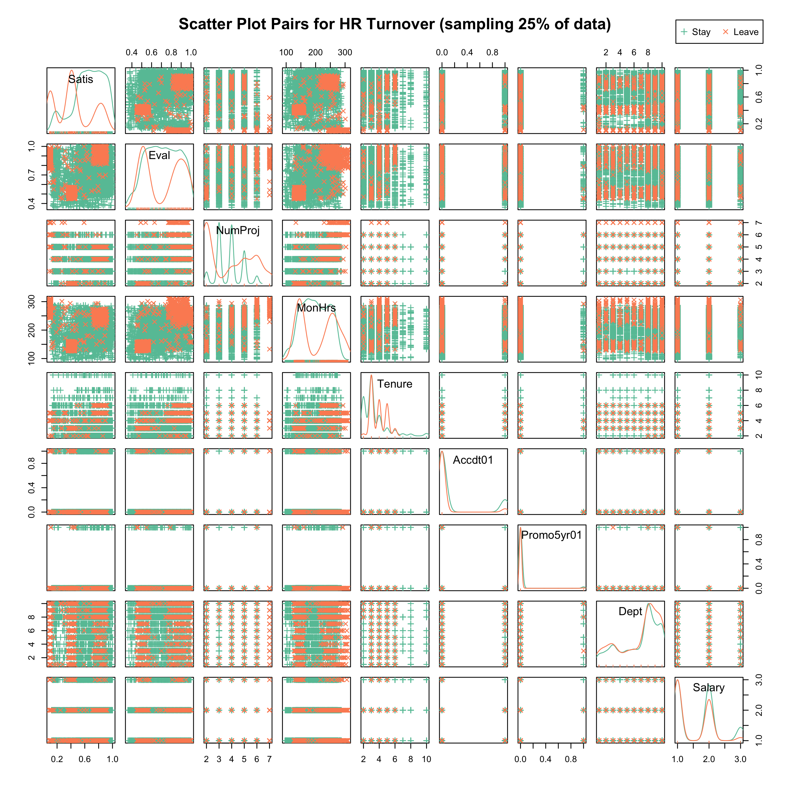

```{r setup, include=FALSE}
knitr::opts_chunk$set(echo = TRUE)
# install.packages("tidyverse")
# install.packages("corrplot")
# install.packages('plyr')
# install.packages("plotly")

library(tidyverse)
library(corrplot)
library(car)
library(RColorBrewer)
library(plotly)
library(plyr)
library(dplyr)

```


## Data Import

```{r, include=FALSE}
# Derive a location (Brisbane, San Francisco or London) from the employee role:
# * 90% of IT staff in Brisbane (5% in each other location)
# * 90% Dept in San Francisco (5% in each other location)
# * 90% other categories in London (5% in each other location)

location <- function(role) {
  prob=switch(as.character(role),
              IT=c(0.9, 0.05, 0.05),
              sales=c(0.05, 0.9, 0.05),
              c(0.05, 0.05, 0.9)
  )
  sample(c('Brisbane','San Francisco','London'), 1, rep=TRUE, prob=prob)
}
```

Load raw data (from https://www.kaggle.com/ludobenistant/hr-analytics), add factors, save.

```{r}
HR <- read_csv("HR_comma_sep.csv", col_types=cols(
  satisfaction_level = col_double(),
  last_evaluation = col_double(),
  number_project = col_integer(),
  average_montly_hours = col_integer(),
  time_spend_company = col_integer(),
  Work_accident = col_integer(),
  left = col_integer(),
  promotion_last_5years = col_integer(),
  sales = col_character(),
  salary = col_character()
))
HR <- plyr::rename(HR, replace=c("satisfaction_level"="Satis", "last_evaluation"="Eval",
            "number_project"="NumProj", "average_montly_hours"="MonHrs",
            "time_spend_company"="Tenure", "Work_accident"="Accdt01", 
            "left"="Left01", "promotion_last_5years"="Promo5yr01",
            "sales"="Dept", "salary"="Salary"))

HR$Salary <- factor(HR$Salary, levels=c("low", "medium", "high"), ordered=TRUE)
HR$Dept <- factor(HR$Dept)

HR$Accdt <- factor(HR$Accdt01 == 1)
HR$Promo5yr <- factor(HR$Promo5yr01 == 1)
HR$Left <- factor(HR$Left01==1)

set.seed(42)
HR$location <- factor(sapply(HR$Dept, location))
write_csv(HR, "HR.csv")
```

***
## Data Summary


### Dimensional Summary

Basic summary of numeric and categorical dimensions of the data showing range and factor counts, respectively.

* Satis: satisfaction level

* Eval: last evaluation

* NumProj: number of projects worked on

* MonHrs: average montly hours worked

* Tenure: years spent with the company

* Accdt01: 1 = accident at work, 0 = none

* Accdt: boolean factor - accident at work true / false

* Left01: 1 = left (terminated), 0 = still employed

* Left: boolean factor - terminated true / false

* Promo5yr01: 1 = received a promotion within the last 5 years, 0 = none 

* Promo5yr: boolean factor - promotion within the last 5 years true / false

* Dept: department where employed / role

* Salary: salary level (high/medium/low)

```{r}
summary(HR)
```


### Pairwise Scatter Plots and Distributions for Staying vs Leaving Staff 

* Most dimensions show significantly different distributions for Staying vs Leaving staff
* Bimodal distributions for Leaving staff are evident for evaluation, number of projects and monthly hours worked
* Clustering for Leaving staff is evident comparing: satisfaction, evaluation and monthly hours worked; tenure across many dimensions; and between some departments


```{r eval=FALSE}
plot.new()
png(filename="hr-scatter.png", res=300, width = 3000, height = 3000)
my_colors <- brewer.pal(3, "Set2")
samp.sz <- 3750
pct <- round(100*samp.sz/nrow(HR))
data <- HR[sample(nrow(HR), samp.sz),]
scatterplotMatrix(~Satis+Eval+NumProj+MonHrs+Tenure+Accdt01+Promo5yr01+Dept+Salary|Left01, data=data, reg.line="", smoother="", col=my_colors , smoother.args=list(col="grey") , pch=c(3,4), legend.plot=FALSE, main=paste("Scatter Plot Pairs for HR Turnover (sampling ",pct,"% of data)", sep=""))
par(xpd=TRUE, cex=0.7)
Ly <- 1.16 # for inline HTML
Ly <- 1.05 # for PNG
legend(x=0.91, y=Ly, c("Stay", "Leave"), col=my_colors, pch=c(3,4), horiz=TRUE)
dev.off()
```



#### Discussion

Pairwise scatterplots and distributions suggest multi-modal distributions and significant clustering between dimensions for the subset of staff that leave. Add features to classify dimensions for:

* evaluation
* satisfaction
* tenure
* number of projects
* monthly hours worked
 

### Pairwise Numeric Correlations

Correlations between all pairs of numeric dimensions are investigated over the full dataset, and within the Leaving and Staying subsets.

Note that three dimensions are binary 0/1 values and need careful interpretation for correlations:

* *Left01* has the value 1 for leave and 0 for stay

* *Promo5yr01* has the value 1 for a promotion within the last 5 years and 0 for none

* *Accdt01* has the value 1 for accident and 0 for none

P-values (and optionally confidence intervals) for all pairs are calculated with the following formula. Correlations not passing the significance test (*p* < 0.01) will be marked with an `✕` in the matrix.

```{r}
cor.mtest <- function(mat, conf.level = 0.95){
  mat <- as.matrix(mat)
    n <- ncol(mat)
    p.mat <- lowCI.mat <- uppCI.mat <- matrix(NA, n, n)
    diag(p.mat) <- 0
    diag(lowCI.mat) <- diag(uppCI.mat) <- 1
    for(i in 1:(n-1)){
        for(j in (i+1):n){
            tmp <- cor.test(mat[,i], mat[,j], conf.level = conf.level)
            p.mat[i,j] <- p.mat[j,i] <- tmp$p.value
            lowCI.mat[i,j] <- lowCI.mat[j,i] <- tmp$conf.int[1]
            uppCI.mat[i,j] <- uppCI.mat[j,i] <- tmp$conf.int[2]
        }
    }
    return(list(p.mat, lowCI.mat, uppCI.mat))
}
```

### Overall Correlations (Within the Full Dataset)

Leaving (where 0=*stay* and 1=*leave*) is correlated with:

* decreasing satisfaction level (-0.39) (negative correlates with decreasing satisfaction)

* no work accidents (-0.15) (leaving correlates with fewer work accidents)

* no promotion (-0.06) (leaving correlates with no promotion in the last 5 years)

Leaving is positively correlated with:

* tenure (0.14) (longer tenure corelates with leaving)

* average hours worked per month (0.07) and number of projects worked (0.02)

Other significant correlations include:

* satisfaction level is most correlated with last evaluation (0.11), and most negatively with number of projects (-0.14) and tenure (-0.10)

* last evaluation is positively correlated with number of projects (0.35), average monthly hours (0.34) and longer tenure (0.13)

* tenure correlates with the number of projects (0.20), monthly hours worked (0.13), and receeving a promotion (0.07)

* number of projects correlates with monthly hours worked (0.42)

```{r}
DF <- HR[1:8]
M <- cor(DF)
pval99 <- cor.mtest(DF,0.99)

corrplot(M, p.mat = pval99[[1]], sig.level=0.01, method = 'pie', order ="hclust", addrect=2,
         tl.col="black", tl.cex = 1, tl.offset = 0.1, tl.srt = 45)
```

#### Discussion

The correlations between leaving and decreasing levels of satisfaction, longer tenure, longer hours of work per month, and low levels of promotion are perhaps not surprising but are important and should be investigated further to try and determine any causes. 

The relationship between accidents at work, increasing job satisfaction and lower rates of leaving could also be investigated further as it seems counter-intuitive.

Gather additional data on:

* The reasons for leaving 

* The basis of job satisfaction and tenure

* The effectiveness of evaluation procedures

* The reasons for (and impact of) persistent over-work or overloading of projects

This data could be gathered through methods including surveys, interviews, exit interviews and project post-mortems.


### Correlations for Staying Employees

* For staff who stay, the strongest correlation is a negative one between job satisfaction and tenure (-0.17)

* Job satisfaction is also negatively correlated with the number of projects worked (-0.09)

* Job satisfaction is positively correlated with evaluation (0.09) and monthly hours worked (0.06)

* Evaluations are positively correlated with monthly hours worked (0.09), job satisfaction (0.09) and the number of projects worked (0.04)

* Tenure is positively correlated with promotion (0.09) and projects worked (0.08)


```{r}
DF <- HR[HR$Left==FALSE,c(1:6,8)]
M <- cor(DF)
pval99 <- cor.mtest(DF,0.99)
corrplot(M, p.mat = pval99[[1]], sig.level=0.01, method = 'pie', order ="hclust", addrect=2,
         tl.col="black", tl.cex = 1, tl.offset = 0.1, tl.srt = 45)
```

#### Discussion

There are fewer correlations in the subset of data for staff who stay than the overall dataset. Surprisingly, the strongest correlation is decreasing job satisfaction levels with increasing tenure with the company. Unsurprisingly, promotions are correlated with increasing tenure and satisfaction levels are correlated with evaluations.

These staff seem to be staying if they are promoted, happier if they receive good evaluations, but unhappier the longer they stay.

* More information should be gathered about tenure and job satisfaction levels


### Correlations for Leaving Employees

For staff who leave:

* Satisfaction is negatively correlated with the number of projects (-0.23) and the monthly hours worked (-0.08)

* Satisfaction is positively correlated with tenure (0.44) and evaluation (0.18)

* Evaluations are positively correlated with monthly hours worked (0.83), the number of projects worked (0.80), tenure (0.78) and job satisfaction (0.18)

* Tenure is positively correlated with evaluation (0.78), monthly hours worked (0.66), number of projects worked (0.60) and job satisfaction (0.44)

```{r}
DF <- HR[HR$Left==TRUE,c(1:6,8)]
M <- cor(DF)
pval99 <- cor.mtest(DF,0.99)
corrplot(M, p.mat = pval99[[1]], sig.level=0.01, method = 'pie', order ="hclust", addrect=2,
         tl.col="black", tl.cex = 1, tl.offset = 0.1, tl.srt = 45)
```

#### Discussion

For the staff who leave, there are some similarities with those who stay: tenure is also positively correlated with the monthly hours worked and with evaluations.

However, there are some significant differences. Tenure is positively correlated with job satisfaction and is negatively correlated with promotion --- the opposite holds for those who stay. 

These staff seem to be hard-working, happier the longer they stay and if they are recieving good evaluations, but leaving after not receiving promotions.

* More information should be gathered about tenure and the opportunity for advancement


***
## Exploratory Data Analysis


### Career advancement

Many people leaving have been with the company at least 4 years but have not had a promotion in the last 5 years, despite working long hours.

```{r}
with(HR, coplot(MonHrs ~ jitter(Tenure) |
                Promo5yr + Left))
```

These unpromoted, long-term workers who leave are receiving the highest evaluations.

```{r}
with(HR, coplot(Eval ~ jitter(Tenure) |
                Promo5yr + Left))
```

These unpromoted, long-term workers who leave are also reporting high levels of satisfaction with the company.

```{r}
with(HR, coplot(Satis ~ jitter(Tenure) |
                Promo5yr + Left))
```

Of the unpromoted workers putting in long hours who are leaving, some report the lowest levels of satisfaction, but more report very high levels of satisfaction. 

The ones who are working the fewest hours report fairly low satisfaction. 

```{r}
with(HR, coplot(MonHrs ~ Satis |
                Promo5yr + Left))
```

The staff on the largest number of projects and who put in the longest hours, with no promotion in 5 years, tend to leave.

```{r}
with(HR, coplot(MonHrs ~ jitter(NumProj) |
                Promo5yr + Left))
```

Of the unpromoted workers who left, many had both high evaluations and high levels of satisfaction.

```{r}
with(HR, coplot(Eval ~ Satis |
                Promo5yr + Left))
```


## 

Plot:
evaluation, satisfaction | hours + Left
evaluation, satisfaction | time with co + Left
evaluation, satisfaction | NumProj + Left
